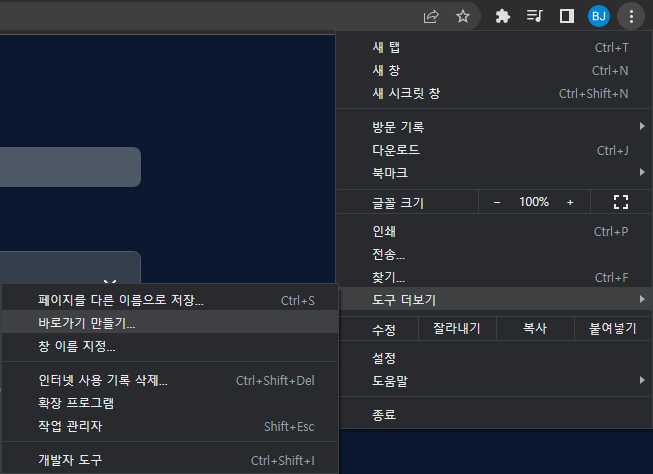
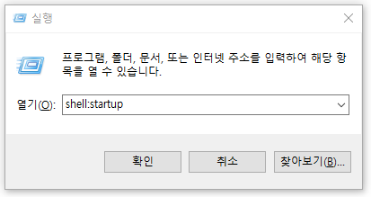
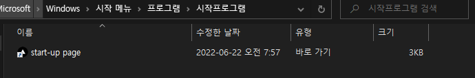

# startup-page(시작 페이지 관리)

## 사용 방법 (윈도우 기준)

### <b>1.1 크롬 설정 -  도구 더보기 -  탭 - 바로가기 만들기를 통해 바탕화면의 새로운 페이지를 만들어줍니다.</b>
 

 

### <b>1.2 `[window]` + `[r]` 키를 눌러 실행창을 엽니다</b>
### <b>1.3 `shell:startup`을 입력하고 확인을 눌러 폴더를 엽니다</b>

 

 

### <b>1.4 이전에 만들어놨던 바로가기 페이지를 폴더 안에 옮겨넣습니다</b>

 

 

---